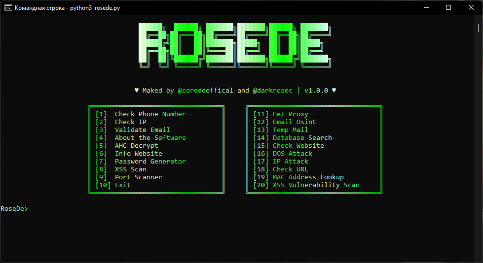

# RoseDe OSINT Tool

RoseDe — это мощный инструмент для OSINT (Open-Source Intelligence), разработанный с использованием Python и библиотеки pystyle для создания красивого пользовательского интерфейса. Текущая версия программы поддерживает функции проверки телефонных номеров, проверки IP и AHC дешифровки.



### Версия

<<<<<<< HEAD
Текущая версия программы: **v.1.0.1**
=======
Текущая версия программы: **v.1.1.1**
>>>>>>> a3b6756 (Добавлены лица и команда №4. Исправлены баги связанные с длинным текстом)

### Авторы

Разработанно Coredé и DarkRose

## Текущие функции

### 1. Проверка номера телефона (Check Phone Number)  
   Позволяет получить информацию о валидности телефонного номера, а также дополнительную информацию, такую как местоположение, оператор, формат и тип линии.
   
   Пример использования:
   - Введите телефонный номер без символа +.
   - Программа вернёт данные в красивой рамке.

### 2. Проверка IP (Check IP)  
   Позволяет получить информацию о местоположении, регионе, интернет-провайдере (ISP) и организационных данных по введённому IP адресу. Также предоставляется ссылка на Google Maps для просмотра широты и долготы.
   
   Пример использования:
   - Введите IP адрес.
   - Получите информацию о стране, городе, интернет-провайдере и другие детали.

### 3. AHC Дешифровка (AHC Decrypt)  
   Позволяет расшифровать текст, закодированный с использованием метода AHC. Для работы функции требуется ввести зашифрованный текст с ключом в конце.

   Пример использования:
   - Введите зашифрованный текст.
   - Программа вернёт расшифрованное сообщение.

## Установка

1. Склонируйте репозиторий:
   ```
   git clone https://github.com/TheCoree/RoseDe.git
   ```
3. Перейдите в папку с программой:
   ```
   cd RoseDe
   ```
5. Установите необходимые зависимости:
   ```
   pip3 install -r requirements.txt
   ```
7. Запустите программу:
   ```
   python3 rosede.py
   ```
## Контакты

Если у вас есть вопросы или предложения, пожалуйста свяжитесь с нами:
  - Telegram: @coredeoffical, @darkrosec
   
   
